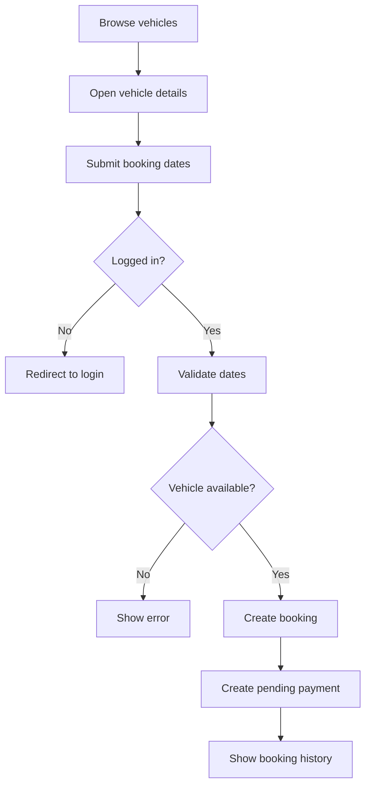
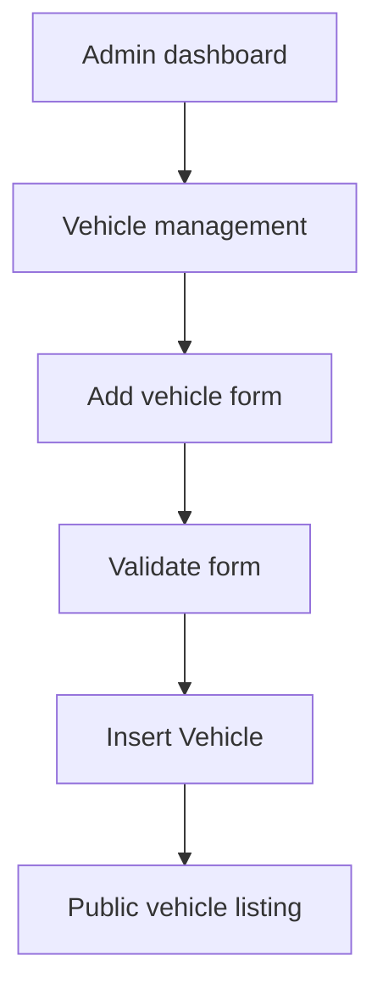
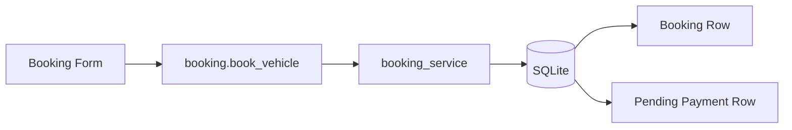

# Development Workflow

## How a User Books a Vehicle

1. User registers or logs in.
2. User opens `/vehicles` and searches by brand, model, category, or registration number.
3. User opens the vehicle details page.
4. User selects booking and return dates.
5. The backend validates dates and checks overlapping active bookings.
6. The backend creates a `Booking` and a pending `Payment`.
7. User sees the booking in `/my-bookings`.

## How an Admin Adds Vehicles

1. Admin logs in with an admin account.
2. Admin opens `/admin/vehicles`.
3. Admin clicks Add vehicle.
4. Admin submits vehicle data.
5. The route validates required form fields.
6. SQLAlchemy inserts the vehicle row.
7. Vehicle appears in public listings.

## Booking Data Flow

## Request Lifecycle

1. Browser sends request to Flask route.
2. Blueprint route handles authentication guard if required.
3. Route reads form data or JSON.
4. Service functions perform business checks.
5. SQLAlchemy ORM reads or writes database rows.
6. Route flashes a message or returns JSON.
7. Template renders the response.

## Database Interactions

- Reads use SQLAlchemy query APIs, for example `Vehicle.query.get_or_404`.
- Writes use `db.session.add`, `db.session.flush` when related IDs are needed, and `db.session.commit`.
- Booking creation writes both `bookings` and `payments`.
- Admin status updates modify existing booking rows.
